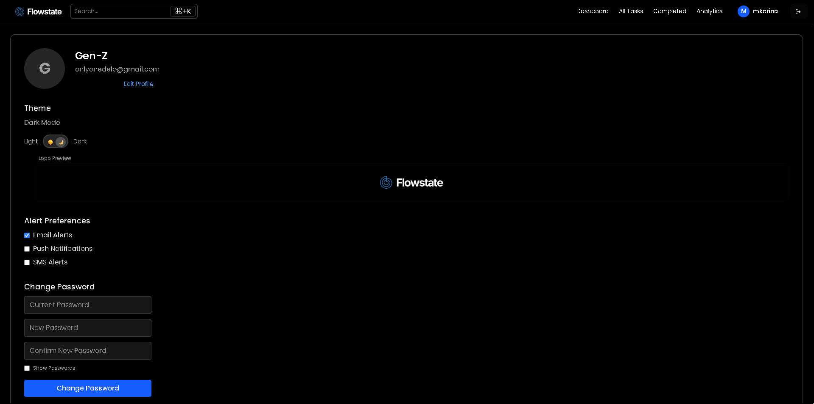

# FlowState Task Manager


## Table of Contents

1. [Overview](#overview)
2. [Features](#features)
3. [Technology Stack](#technology-stack)
4. [How It Works](#how-it-works)
5. [Getting Started](#getting-started)
6. [Folder Structure](#folder-structure)
7. [Security & Data Integrity](#security--data-integrity)
8. [Preview Images](#preview-images)
9. [License](#license)
10. [Current File Structure](#current-file-structure)

---

# FlowState Task Manager

## Overview

FlowState is a modern, full-stack productivity app designed to help users manage tasks efficiently with a focus on personalization, security, analytics, and seamless user experience. It is built for individuals and teams who want a secure, customizable, and data-driven approach to productivity.

### Key Features

- **User Authentication:** Secure signup and login with password hashing. User sessions are persisted for convenience.
- **Personalized Dashboard:** Each user sees only their own tasks, stats, and profile information.
- **Task Management:** Create, view, update, complete, and delete tasks. Tasks are tied to the logged-in user for privacy and organization.
- **Search & Filtering:** Real-time search and advanced filtering by category, priority, status, and completion. Search results show only the user's tasks.
- **Modern UI/UX:** Responsive design with theme toggling, user settings, and mobile-friendly navigation.
- **Statistics Overview:** Visual breakdown of task stats (completed, pending, overdue, by priority, status, and category).
- **Alert Preferences:** Users can set alert preferences for deadlines and important updates.
- **Atomic Data Storage:** All user and task data is stored securely in JSON files with atomic write operations to prevent data loss.

### Technology Stack

<p align="left">
  
  
  
  
  
  
  
</p>

- **Frontend:** React (functional components, hooks), Tailwind CSS for styling, Vite for fast development.
- **Backend:** Express.js REST API, bcryptjs for password security, file-based storage (users.json, tasks.json).
- **API Integration:** Frontend communicates with backend via a singleton API service, ensuring all requests are user-specific.
- **CORS:** Configured for local and deployed environments to allow secure cross-origin requests.

### How It Works

1. **User Registration & Login:**
   - Users sign up with name, email, and password.
   - Passwords are hashed and stored securely.
   - On login, user data is persisted in localStorage for session continuity.

2. **Task Operations:**
   - Users can create tasks with details like title, description, category, priority, due date, etc.
   - Each task is tied to the user's unique ID (`userId`).
   - Only the logged-in user's tasks are fetched, displayed, and searchable.

3. **Search & Filtering:**
   - Header and mobile header components allow users to search tasks in real-time.
   - All search/filter requests include the user's ID, ensuring privacy and relevance.

4. **Statistics & Alerts:**
   - Dashboard displays personalized stats and alerts based on the user's tasks.
   - Users can set preferences for notifications and theme.

### Getting Started

1. **Install Dependencies:**
   - Frontend: `npm install` in the `Frontend` directory.
   - Backend: `npm install` in the `Backend` directory.

2. **Run the App:**
   - Start backend: `node server.js` (or `npm start` if configured)
   - Start frontend: `npm run dev` (Vite)
   - Access the app at `http://localhost:5173` (frontend) and `http://localhost:5000` (backend API)

3. **Register and Start Managing Tasks!**

### Folder Structure

- `Frontend/` - React app source code
  - `src/components/` - UI components (Dashboard, Header, User, etc.)
  - `src/Services/api.js` - API service for backend communication
- `Backend/` - Express server and data storage
  - `server.js` - Main backend logic
  - `data/users.json` - User data
  - `data/tasks.json` - Task data

### Security & Data Integrity

- Passwords are never stored in plain text.
- All data writes are atomic to prevent corruption.
- Only authenticated users can access or modify their own tasks.

### License

MIT License


### Current File Structure

## Preview Images

Below are screenshots of the main features and analytics views:

<p align="center">
  
  
  
  
  
  
  
</p>

```
MCC/
├── Backend/
│   ├── data/
│   │   ├── task.json
│   │   ├── tasks.json
│   │   └── users.json
│   ├── middleware/
│   │   └── auth.js
│   ├── routes/
│   │   ├── auth.js
│   │   └── tasks.js
│   ├── utils/
│   │   └── fileHandler.js
│   ├── server.js
│   ├── package.json
│   ├── package-lock.json
│   └── README.md
├── Frontend/
│   ├── public/
│   │   └── favicon.svg
│   ├── src/
│   │   ├── assets/
│   │   │   ├── favicon.svg
│   │   │   └── logo.svg
│   │   ├── components/
│   │   │   ├── Analytics.jsx
│   │   │   ├── CompletedTasks.jsx
│   │   │   ├── Dashboard.jsx
│   │   │   ├── Header.jsx
│   │   │   ├── HeaderMobile.jsx
│   │   │   ├── Login.jsx
│   │   │   ├── Main.jsx
│   │   │   ├── Tasks.jsx
│   │   │   ├── User.jsx
│   │   │   └── useViewport.jsx
│   │   ├── Services/
│   │   │   └── api.js
│   │   ├── App.css
│   │   ├── App.jsx
│   │   ├── index.css
│   │   └── main.jsx
│   ├── package.json
│   ├── package-lock.json
│   ├── vite.config.js
│   ├── eslint.config.js
│   ├── index.html
│   ├── index.js
│   └── README.md
├── MVP.md
├── README.md
```
